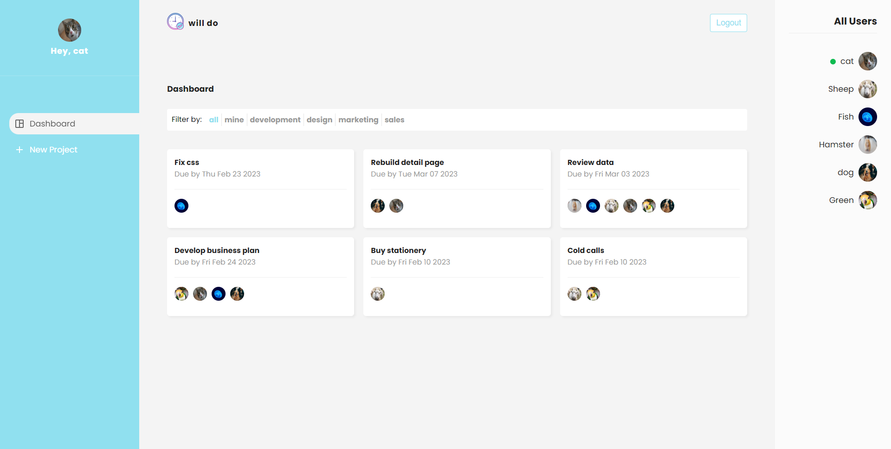
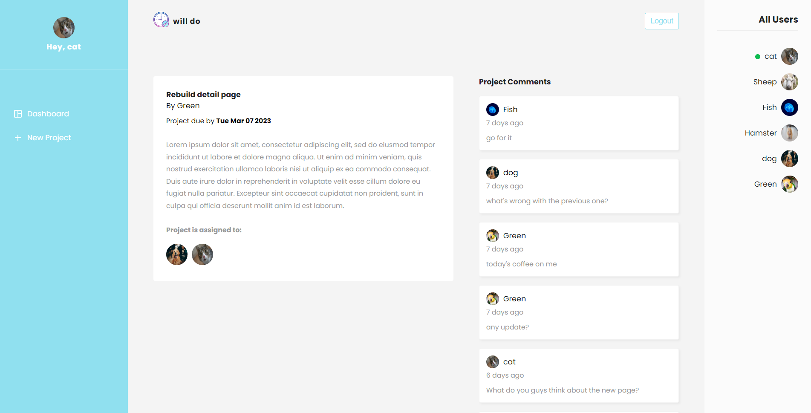

# project Management App - will do

## Overview

Users should be able to:

- Signup the app
- Login & logout
- See if another user is online or offline
- See the list of projects after successfully login, signup or adding a new project
- Filter projects by category
- Leave comments on the project detail page
- Delete the project if they own it
- Projects are protected from the backend, so only the author can read and write the project
- Feel free to use demo accounts to play around:

  emails:  
  cat@cat.com  
  dog@dog.com  
  rat@rat.com  
  sheep@sheep.com  
  green@green.com  
  fish@fish.com

  password(all the same): 123456

### Screenshot

### Links

- Live Site URL: [https://projectmanagementsite-d8a50.web.app/]

### Built with

- React Hooks: useState, useEffect, useReaducer, UseRef, useParams
- ReactContext
- React Router
- React Custom Hooks
- React props
- Firebase: Fetching data,
- JavaScript
- Fetch
- async await
- CSS
- HTML
  ...

### Continued development

- Editing a project
- archiving a project
- notification system
- messaging system
